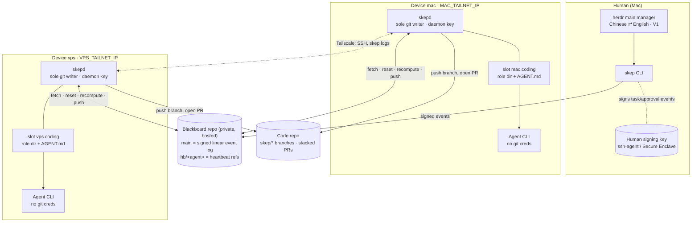
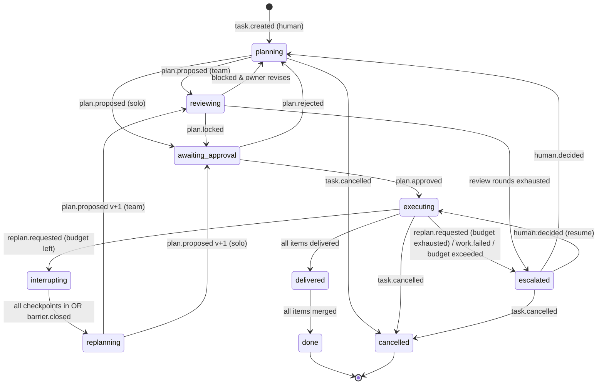

# Skep: Cross-Device, Decentralized Collaboration for AI Coding Agents — Product Requirements Document

> **Draft v0.4** · 2026-10-05 · Product name "Skep" (formerly "Fleet"; domain skepagent.com)
> Supersedes: Draft v0.3 (2026-10-04/05). This document is self-contained; reading v0.3 is not required.
> Inputs: v0.3 PRD, Codex feasibility review ("feasible with major changes"), Claude review summary ("feasible only with major changes").

---

## 0. Changelog (v0.4 vs. v0.3)

| # | Area | v0.3 | v0.4 |
|---|---|---|---|
| 1 | Event ordering | Contradictory: "last event after sorting by time" vs. "git commit order"; filename UTC timestamps | **Single authority: position on the blackboard repo's linear `main` (first-parent index).** Timestamps are display-only. A deterministic, versioned reducer derives all state. |
| 2 | Write path | Push; on rejection `pull --rebase` and retry | **fetch → reset → recompute → push. Never rebase.** Every event records the tip it was computed against; the reducer rejects events whose parent differs. |
| 3 | Claims | Path-as-lock (`claims/<task>/<sub>.md`, "creation = lock"); lease in file; reclaim via `claim-expired` | **Epoch-fenced leases** as immutable events. Every downstream event and code branch carries the lease epoch; stale epochs are rejected. Mandatory lease re-verification before delivery (sleep/wake safe). **No automatic takeover in the MVP.** |
| 4 | Heartbeats | `agents/<id>/heartbeat.json` overwritten on `main` | **`hb/<agent>` refs off `main`** (orphan, single-commit, force-updated). **Observer-relative TTLs** on the observer's monotonic clock. Zero bloat/contention on `main`. |
| 5 | Security | Advisory: private repo, deploy keys, "treat as data" | **Blackboard = remote command channel → signing mandatory.** SSH-signed commits verified against a local `allowed_signers`; only the human key can create tasks; the daemon owns all git writes; agent CLIs have no push credentials. GitHub web-UI commits are no longer accepted. |
| 6 | LLM output | Markdown + YAML free-form; evidence = free text | **Strict JSON** validated by the daemon; **typed, machine-checkable evidence** pinned to commit SHAs; test results captured by the daemon, never asserted by the model. |
| 7 | Replanning | Partial, scoped pause at "safe points"; unaffected agents keep running | **Coarse replan:** interrupt-and-checkpoint the **whole task** behind an explicit barrier, mechanical snapshots, versioned replan. Plan owner decides; **escalate to the human after 2 replans**. Partial replanning deferred. |
| 8 | Default mode | Always multi-agent plan → peer review | **Single-agent fast path is the default.** Team mode only when needed (capability split, explicit request). |
| 9 | Delivery | Parallel PRs + integration branch | **Stacked PRs** with explicit dependency semantics (downstream starts from upstream's delivered SHA). |
| 10 | Process | Build features, then test | **Simulation harness built first** (days 2–3), with fault injection and invariant checks. |
| 11 | Language | Unspecified (mixed) | **English on the blackboard and agent-to-agent.** Only the human-facing layer (herdr main manager) translates to Chinese. |
| 12 | Runtime | herdr "API to be investigated" | herdr CLI surface specified conceptually (`agent prompt/wait/read/start`, `pane run/wait-output`, `worktree create`, `api snapshot/schema`, `--machine`); optional, with non-interactive fallbacks. |
| 13 | Topology | Per-agent daemons each writing git | **One `skepd` per device**, hosting one or more agent slots; one serialized git writer per device. |
| 14 | MVP | 2–3 weeks, 2 roles, full protocol, 2 adapters | **2 weeks:** 2 devices, 1 adapter, coding role only, coarse replan, stacked PRs; day-by-day plan (§16). |
| 15 | Availability promise | "No offline device blocks any other device" | Honest promise: already-authorized work continues while a peer is offline; the hosted blackboard remote is the single writable authority and its outage fails closed (§12). |

---

## 1. Background and Problem

The user runs coding agents (Codex, Claude Code, pi) on more than one machine:

| Device | Role | Network | Notes |
|---|---|---|---|
| **`mac`** — user's Mac | Human control point; holds the **human signing key**; runs a coding agent | Tailscale `MAC_TAILNET_IP` | Xcode, signing certificates, local GUI; sleeps when the lid closes |
| **`vps`** — cloud VPS | Always-on worker; runs a coding agent | Tailscale `vps` / `VPS_TAILNET_IP` | 24/7, good network, suited to long-running tasks |

Each device may have herdr installed (single-machine agent/worktree manager) and manages its own provider configuration with cc-switch.

Today the user moves work between machines by hand: SSH in, sync code, re-explain context, check status manually. A single central controller (tried in v0.2) creates a single point of failure (Mac lid closed ⇒ nothing progresses) and a capacity bottleneck. v0.3 moved to peer-to-peer coordination over git, but both reviews found correctness gaps: ambiguous event ordering, unsafe lease reclamation, rebasing of stale decisions, heartbeat bloat, unauthenticated writes to what is effectively a remote command channel, and an unbounded replanning protocol. v0.4 fixes these and cuts the MVP to something one developer can ship in two weeks.

## 2. Product Summary

Skep is a **protocol + a per-device daemon (`skepd`) + a CLI (`skep`)** that lets coding agents on several devices work as a small team:

- The human issues a signed task from the Mac (or via the herdr main manager, in Chinese).
- By default a **single agent** plans, executes in its own worktree, and delivers a PR (fast path).
- When needed (capability split, explicit request), the task runs in **team mode**: a plan with several work items, one peer review, leases held by agents on different devices, and **stacked PRs**.
- All coordination flows through a **git "blackboard" repo** whose linear `main` is an **event log**; every daemon replays it with the same deterministic reducer and reaches the same state.
- When a plan turns out to be wrong, the whole task is **interrupted, checkpointed and replanned**; after two replans the human decides.
- The human merges.

One-liner: **herdr manages one machine; Skep turns agents on several machines into a team; a signed, linear git log is their shared blackboard.**

## 3. Goals and Non-Goals

### 3.1 Goals

| ID | Goal | MVP? |
|---|---|---|
| G1 | Issue a task on one device and receive a PR produced on another device with no manual SSH, file copying, or context re-explaining. | MVP |
| G2 | Correctness under concurrency and partial failure: replay determinism, at most one accepted delivery per work-item epoch, no stale decisions applied, no duplicate PRs after crashes. | MVP |
| G3 | Structural security: only the human can create tasks; only daemons can write git; every blackboard record is signed and attributable. | MVP |
| G4 | Plan-first execution with versioned plans, reviews, and bounded replanning with human escalation. | MVP (coarse replan) |
| G5 | Single-agent fast path by default; multi-agent only when it pays for itself. | MVP |
| G6 | Auditability: any device can reconstruct "who decided what, based on which state, at which log position". | MVP |
| G7 | Bounded cost: per-task budgets for invocations, wall time and (where reported) tokens; escalate instead of silently spending. | MVP (invocations + wall time) |
| G8 | Human-facing experience in Chinese via the herdr main manager, while all machine/agent content stays English. | V1 (MVP provides `--machine` JSON) |
| G9 | Multiple adapters (Codex, Claude Code, pi) and multiple roles (coding, design, review). | V1 |

### 3.2 Non-Goals

**Never (product boundaries):**
- Not a general distributed task queue, CI system, or consensus service.
- Not a coding agent; Skep orchestrates existing CLIs only.
- Does not install agent CLIs or manage provider accounts; does not help circumvent any provider's terms or regional restrictions.
- No secret storage or secret distribution through the blackboard.
- No multi-tenant / hostile-peer security model (Skep targets a single trusted owner's skep).

**Not in the MVP (may come later):**
- Automatic lease expiry/takeover and automatic owner failover.
- Partial (scoped) replanning; arbitrary DAGs and parallel work items within one task.
- More than one adapter; non-coding roles; more than two devices.
- Notification channel (NATS/MQTT/HTTP hints), mobile UI, TUI/web dashboard.
- herdr runtime integration and the Chinese human layer (MVP exposes the hooks only).
- Automated merge, automated restacking after conflicts, `skep provider copy`.
- Blackboard history compaction.
- Task issuance from a phone (requires a human signing key on the phone; see §19).

## 4. Target Users and Core Scenarios

Target user: an individual developer (initially this user) who runs multiple machines and multiple coding agents, is fluent with git/PR workflows, and already networks machines via Tailscale.

| Scenario | Flow | MVP? |
|---|---|---|
| **S1 Fast path from the Mac** | User runs `skep task new --repo myapp "Add dark mode toggle to settings"`. Owner `vps.coding` drafts a plan (1 work item), the human approves with `skep plan approve`, the VPS executes, daemon runs checks, pushes, opens a PR. The Mac lid can close right after approval. | MVP |
| **S2 Team mode across devices** | Task needs a refactor (VPS) and an Xcode UI test pass (Mac). Plan v1 has two stacked items W1 (`vps.coding`) → W2 (`mac.coding`, `requires: [xcode]`). `mac.coding` reviews the plan; human approves. W2 starts from W1's delivered SHA; PR #2 is stacked on PR #1. | MVP |
| **S3 Coarse replan** | During W1, the agent's structured output reports that the assumed `GET /api/user/preferences` endpoint does not exist (evidence: daemon-captured command run, exit code, SHA). Daemon emits `replan.requested`; the whole task is interrupted, checkpointed, owner drafts plan v2, reviewed and approved, new leases are granted with higher epochs. | MVP |
| **S4 Escalation** | A third replan request arrives (replan budget = 2). Task becomes `escalated`; the human sees evidence and decides via `skep decide`. | MVP |
| **S5 Sleep/wake safety** | `mac.coding` holds W2 (epoch 1) and the Mac sleeps for 3 hours. Human revokes the lease and W2 is re-leased to `vps.coding` (epoch 2). When the Mac wakes, its daemon re-verifies the lease before delivering, sees epoch 2 ≠ 1, and abandons its attempt; nothing stale is accepted. | MVP (manual revoke) |
| **S6 Status anywhere** | `skep status` on either device shows tasks, plan versions, leases (with epochs), per-agent liveness (observer-relative), PR links, and the log position/freshness it was computed from. | MVP |
| **S7 Chinese conversation** | User talks to the herdr main manager in Chinese; it translates to English, calls `skep ... --machine`, and reports back in Chinese. | V1 |

## 5. Design Principles

1. **Peers for work, one log for truth.** There is no orchestrator process making agent decisions; every agent's daemon is a peer. Authority comes from the single linear `main` of the blackboard repo — the only writable coordination authority.
2. **Order = log position.** Never wall-clock, never commit time, never filename timestamps.
3. **Deterministic code enforces the protocol; LLMs only produce content.** Models propose plans, reviews and code. Daemons validate, authorize, sequence, test, commit and publish.
4. **Fence, don't trust.** Liveness signals are suspicions; safety comes from epochs and preconditions checked by the reducer.
5. **Sign everything that can cause action elsewhere.** The blackboard triggers execution on other machines; treat it like a remote shell.
6. **Default to one agent.** Coordination has real latency and LLM cost; pay it only when needed.
7. **Fail closed, recover explicitly.** Uncertain outcomes are reconciled, not retried blindly; ambiguous states go to the human.
8. **Simulate before you distribute.** Every protocol behavior is exercised in a deterministic simulation harness before it touches two real machines.
9. **English for machines, Chinese for the human.** One translation boundary, at the human-facing layer.
10. **Reuse, don't depend.** Use herdr/Tailscale/gh where present; work with plain subprocesses where not.

## 6. System Architecture

### 6.1 Overview



Key properties:
- **No orchestrator.** The blackboard remote runs no logic. Each `skepd` independently replays the log and acts only on its own agents' behalf.
- **The Mac is the human's control point, not a scheduler.** It holds the human key and can run agents; once a plan is approved, work on `vps` proceeds with the Mac asleep.
- **Single writable authority.** The hosted blackboard `main` is the only place where coordination writes take effect. Mirrors (if any) are read-only backups.
- **Networking honesty.** Git traffic to the hosted remote and provider API calls go over the public internet (TLS/SSH), not Tailscale. Tailscale carries device-to-device SSH (`skep logs`, provisioning, the human-layer bridge) and, later, the optional notification hint channel.

### 6.2 Components

| Component | Runs on | Responsibility | MVP? |
|---|---|---|---|
| `skep` CLI | Any device (human commands need the human key → Mac) | Issue tasks, approve/reject plans, revoke leases, decide escalations, cancel, status, logs, doctor. Every write goes through the same write loop. | MVP |
| `skepd` | One per device (launchd on Mac, systemd on VPS) | Sole git writer on the device; blackboard sync; reducer; slot scheduling; adapter invocation; checks; code pushes; PR creation; heartbeats; local run journal; reconciliation on restart. | MVP |
| Agent slot | Inside `skepd` | One role directory + AGENT.md + agent CLI binding = one agent ID. | MVP (1 per device) |
| Adapter | Inside `skepd` | Uniform non-interactive invocation of Codex / Claude Code / pi; schema-constrained JSON output; bounded runtime; interrupt. | MVP: 1 adapter |
| Runtime backend | Inside `skepd` | Native subprocess (process group) → herdr (optional) | MVP: native |
| Evidence verifier | Inside `skepd` | Mechanically checks typed evidence against the code repo at pinned SHAs and the daemon's run journal. | MVP |
| Simulation harness | Dev/CI | Deterministic multi-daemon simulation over local bare repos with fault injection. | MVP (built first) |
| Blackboard repo | Hosted private git remote | Signed linear event log on `main`; `hb/*` heartbeat refs. | MVP |
| Code repo | Hosted git remote | Work branches and stacked PRs; human merge. | MVP |
| Human notifier | ntfy/Telegram | Approval needed, escalation, delivery, failure. | MVP (ntfy) |
| herdr main manager | Mac (herdr) | Chinese conversation ⇄ English `skep` commands. | V1 |

### 6.3 What an "agent" is

**Agent = one `skepd` slot + one agent CLI binding + one role directory.**
- `skepd` decides *when* and *whether* to act (protocol).
- The agent CLI decides *what* to write (plans, reviews, code) and returns structured JSON.
- The role directory's `AGENT.md` declares *who I am, what I can do, what I must not touch*.

## 7. Roles, Agent Identity, and AGENT.md

### 7.1 Role by start directory

The role is determined by the directory from which the slot is started:

```text
~/skep/myapp/
├── coding/                 # coding role directory
│   ├── AGENT.md            # owned by the daemon user; read-only to the agent user
│   └── .skep/             # daemon-owned
│       ├── worktrees/<task>/<item>-e<epoch>/
│       └── journal/        # local run journal (attempts, PIDs, outcomes)
└── design/                 # design role directory (V1)
    └── AGENT.md
```

```bash
cd ~/skep/myapp/coding && skep agent start      # registers slot "<device>.coding" with skepd
```

### 7.2 Agent ID and identity lifecycle

- Format: `<device>.<role>[.<n>]` → `mac.coding`, `vps.coding`, later `vps.coding.2`.
- `device` comes from `~/.skep/device.toml`; it must match the principal of the device's daemon signing key (`daemon:<device>`), so an ID cannot be claimed by another device.
- Each `skepd` start generates a random `boot_id`, included in heartbeats. A local lock file prevents two daemons on one device; two different `boot_id`s for the same agent seen on `hb/*` raise a `duplicate-daemon` alarm.
- On first start the daemon emits `agent.registered` (profile: role, capabilities, `requires`, CLI + pinned version). Re-registration with a changed profile emits a new `agent.registered`; the reducer keeps the latest.

### 7.3 AGENT.md

YAML front-matter (machine-readable, validated) + English body (instructions given to the model). AGENT.md is **trusted local policy**: it lives outside any code worktree and is not writable by the agent user.

```markdown
---
schema: skep.agent/v1
role: coding
agent_cli: codex            # codex | claude | pi   (MVP: one)
cli_version: "pinned-x.y.z" # adapter refuses to run on mismatch
repos:                      # must be a subset of the device allowlist
  - git@github.com:<owner>/myapp.git
capabilities: [typescript, swift, unit-tests]
requires_local: [xcode]     # capabilities only this device has
max_parallel_items: 1
budgets:
  max_invocation_minutes: 45
---

# Responsibilities
Implement application code and unit tests for assigned work items.

# Boundaries
- Never modify files under design/.
- Mark any database migration or production configuration change as risk: high.
- Do not attempt to push, open PRs, or edit .git; the daemon does this.
```

## 8. Data Model: Two Git Repos

### 8.1 Code repo

- Branch per work-item **attempt**, namespaced by epoch: `skep/<task_id>/<item_id>/e<epoch>` (e.g. `skep/T-20261005-7f3a/W2/e2`). A stale holder can therefore never overwrite the current holder's branch.
- Only `skepd` pushes, using the device's code-repo credentials. The agent CLI edits files in a worktree that has **no remote credentials**.
- Daemon-made commits are signed with the daemon key; WIP/checkpoint commits use the `skep-wip:` prefix.
- **Stacked PRs:** item `Wk`'s PR targets the branch of `Wk-1`'s delivered attempt; the first item targets the plan's base branch. The human merges bottom-up using **merge commits** (not squash) so descendants stay valid; after a merge, `skepd` retargets the next PR to the base branch (`gh pr edit --base`).
- Branch protection on code `main`: PR required, human approval, no force push.

### 8.2 Blackboard repo

A separate private repo. **No secrets; no product code** (evidence may include excerpts ≤ 20 lines, always with a pinned SHA and hash).

```text
skep-blackboard/                       (branch: main — linear, signed)
├── skep.json                          # genesis: protocol version, blackboard id (human-signed)
├── policy/allowed_signers.txt          # informational copy; NOT the trust root (see §11)
└── events/
    ├── _skep/<event_id>.json          # cluster-level events (agent.registered, …)
    └── <task_id>/<event_id>.json       # task events

refs/heads/hb/<agent_id>                # heartbeat refs (orphan, force-updated; §10.5)
```

**Structural rules (checked by the reducer):**

1. `main` is linear: every commit after genesis has exactly one parent. No merge commits.
2. Every commit after genesis **adds exactly one event file** and modifies nothing else.
3. Every commit is signed by a key in the local trust root; the signer principal must be allowed to emit the event's type with the event's `actor` (§11.3).
4. The event's `observed_tip` must equal the commit's parent. (An event computed against any other state is invalid — this makes rebasing useless by construction.)
5. `event_id`s are unique; a duplicate `event_id` later in the log is ignored (idempotent retries).
6. Commits violating rules 1–4 are **skipped as no-ops and raise an alarm**; skipping is deterministic because validity depends only on the log and the trust root.

Hosting settings for `main`: require signed commits, require linear history, block force pushes and deletion, **no required PR reviews** (that would break push-based coordination). `hb/*` branches are unprotected.

### 8.3 Ordering

- **Log position** `seq` = 1-based index of a commit in `git rev-list --first-parent --reverse main` (genesis = 0).
- `seq` is the only ordering used by the reducer, by preconditions, and by status output (`#412`).
- `created_at` in events and git commit dates are **display/diagnostics only**. Clock skew cannot change state.

### 8.4 Event envelope

```json
{
  "schema": "skep.event/v1",
  "event_id": "evt_6c1f0e9a-3b7d-4c55-9a0e-2f1d8b7a4c21",
  "type": "lease.claimed",
  "task_id": "T-20261005-7f3a",
  "actor": "vps.coding",
  "observed_tip": "9d2e4b1c0a…",
  "pre": { "task_rev": 17, "plan_version": 2, "plan_hash": "sha256:ab12…", "item": "W1", "expected_epoch": 0 },
  "created_at": "2026-10-05T09:14:03Z",
  "lang": "en",
  "payload": { "item": "W1", "attempt_id": "att_01", "branch": "skep/T-20261005-7f3a/W1/e1" }
}
```

- `task_rev` = number of accepted events for that task so far; `pre` lists every fact the action depends on. If any precondition is false at the event's position, the reducer rejects the event (recorded as `rejected`, no state change).
- Payload size limit: 64 KiB; strict schema (unknown fields rejected).

### 8.5 Event types

| Type | Emitted by (actor) | Key payload | Effect |
|---|---|---|---|
| `agent.registered` | daemon for its slot | role, capabilities, requires_local, cli+version | Upsert agent profile |
| `task.created` | **human only** | title, body (English), repo, base_branch, mode (`solo`/`team`), owner, budgets, optional `original_text`/`original_lang` | Task → `planning`; owner_gen = 1 |
| `task.cancelled` | human | reason | Task → `cancelled`; all leases revoked |
| `owner.transferred` | human (MVP) | new_owner | owner_gen += 1; old owner's later plan events rejected |
| `plan.proposed` | current owner | version, parent_version, plan (JSON, §9.2), plan_hash, base_commit, reviewers | Task → `reviewing` (team) or `awaiting_approval` (solo) |
| `review.submitted` | listed reviewer | plan_version, plan_hash, verdict (`approve`/`block`/`comment`), blockers[] with evidence | Recorded against that version |
| `plan.locked` | current owner | plan_version, plan_hash, overrides[] (block → rationale), missing_reviews[] | Version frozen; if approval policy = `owner`, task → `executing` |
| `plan.approved` / `plan.rejected` | human | plan_version, plan_hash, note | Approved+locked → `executing`; rejected → `planning` (counts as a review round) |
| `lease.claimed` | agent eligible for item | item, attempt_id, branch | epoch = previous epoch + 1; holder set |
| `lease.released` | holder | item, epoch, reason | Item → `ready` (epoch kept) |
| `lease.revoked` | human (MVP); owner with liveness evidence (V1) | item, epoch, reason, observed_hb | Item → `ready`; epoch fenced |
| `checkpoint.recorded` | holder | item, epoch, mechanical snapshot (§10.7) | Stored; satisfies replan barrier |
| `work.delivered` | holder | item, epoch, branch, head_sha, pr_url, pr_number, check_runs[] | Item → `delivered`; dependents become `ready` |
| `work.failed` | holder | item, epoch, class (`invalid_output`/`checks_failed`/`timeout`/`permission_prompt`/`crash`), detail | Item → `failed`; task → `escalated` unless retry budget remains |
| `replan.requested` | any holder, owner, or human | evidence[], summary | Opens barrier; task → `interrupting` (or `escalated` if replan budget exhausted) |
| `barrier.closed` | owner or human | barrier_id, missing[] | Missing items → `unknown`; their leases revoked; task → `replanning` |
| `item.merged` | any daemon (observed via `gh`) or human | item, pr_number, merge_sha | Item → `merged`; task → `done` when all merged |
| `task.verified` | owner's daemon | top_of_stack_sha, check_runs[] | Combined result of the full stack checked |
| `human.decided` | human | decision (`resume_with_plan`/`replan`/`cancel`/`reassign_owner`), note | Clears `escalated` |

### 8.6 State machines

**Task:**



**Work item:** `blocked` (deps not delivered) → `ready` → `leased(epoch)` → `delivered` → `merged`; side states `interrupted`, `unknown`, `failed`. Late events for a terminal task (cancelled/done) are rejected.

## 9. Protocol Details

### 9.1 Task issuance

```bash
skep task new --repo myapp --owner vps.coding "Add a dark mode toggle to Settings; follow system or manual; persist choice."
```

- Must be signed with the **human key** (principal `human`). Daemons cannot create tasks; GitHub web-UI commits (signed by the host's key) are invalid.
- `--repo` must be in each executing device's local allowlist; otherwise that device refuses to plan or lease.
- Default `mode: solo`. `--team` or a plan that the human approves with multiple items/devices switches to team mode.
- Default owner: `vps.coding` (always-on). The human may name another.
- `task_id` = `T-<yyyymmdd>-<4 hex>` (readable, carries no ordering meaning).

### 9.2 Planning (plan-first)

The owner's daemon invokes the adapter with the task, repo context at `base_commit`, and agent profiles. The model must return a `skep.plan/v1` JSON object:

```json
{
  "schema": "skep.plan/v1",
  "task_id": "T-20261005-7f3a",
  "version": 2,
  "parent_version": 1,
  "base": { "repo": "git@github.com:<owner>/myapp.git", "branch": "main", "commit": "a1b2c3d4e5" },
  "mode": "team",
  "summary": "Make theme runtime-switchable, then wire the Settings toggle and UI tests.",
  "items": [
    { "id": "W1", "title": "Subscribable ThemeProvider", "role": "coding",
      "assignee": "vps.coding", "depends_on": [],
      "touches": ["src/theme/"], "risk": "normal",
      "acceptance": [ { "kind": "check", "name": "unit" },
                      { "kind": "manual", "text": "Theme changes without reload." } ] },
    { "id": "W2", "title": "Settings toggle + UI tests", "role": "coding",
      "assignee": "mac.coding", "depends_on": ["W1"], "requires": ["xcode"],
      "touches": ["src/settings/", "ios/UITests/"], "risk": "normal",
      "acceptance": [ { "kind": "check", "name": "ios-ui" } ] }
  ],
  "stack_order": ["W1", "W2"],
  "changes_from_parent": "Accepted mac.coding blocker: theme loads once at startup (evidence ev_1)."
}
```

Daemon validation before publishing `plan.proposed`:
- Schema-valid; `stack_order` is a linear chain consistent with `depends_on` (MVP: linear only).
- Every `assignee` is a registered agent whose role/capabilities/`requires_local` match.
- Every `check` name exists in the **trusted checks file** read from the code repo **at `base_commit`** (`.skep/checks.toml`, which only humans change via merged PRs) — never from plan text or from the agent's worktree.
- `touches` paths exist at `base_commit` or are under an existing directory (warning otherwise).
- Item count ≤ 4 (MVP), budgets present.

### 9.3 Review

- **Solo mode:** no peer review; deterministic validation (above) acts as the self-check; plan goes to human approval.
- **Team mode:** exactly the reviewers listed in `plan.proposed` (frozen; MVP: one peer — another agent that is an assignee). Reviewer returns `skep.review/v1`:

```json
{
  "schema": "skep.review/v1",
  "plan_version": 1,
  "plan_hash": "sha256:9f0c…",
  "verdict": "block",
  "blockers": [
    { "id": "B1", "claim": "Theme is loaded once at startup; W2 cannot switch at runtime without W1 refactor.",
      "acceptance_gap": "W2.acceptance[0]",
      "evidence": [ { "id": "ev_1", "type": "file_span",
                      "repo": "git@github.com:<owner>/myapp.git", "commit": "a1b2c3d4e5",
                      "path": "src/theme/index.ts", "lines": [38, 47], "sha256": "5e7d…" } ] }
  ],
  "suggestions": ["Consider persisting choice in localStorage first."]
}
```

- `block` requires ≥ 1 blocker with ≥ 1 **verified** evidence item; otherwise the daemon downgrades it to `comment`. `suggestions` are advisory and never block.
- "No blocker found" (`approve`) is an explicitly acceptable answer; prompts discourage objecting for its own sake.
- **Owner decides:** the owner either proposes v+1 addressing blockers, or locks with `overrides: [{blocker, rationale}]`. Unanimity is never required. Overrides are shown prominently to the human at approval.
- Review timeout (owner's local monotonic clock, default 15 min): owner may lock with `missing_reviews`.
- Review-round budget: 2 rejected/blocked versions before lock → `escalated`.

### 9.4 Approval and lock

- Policy `plan_approval = "human"` (MVP default) — the human signs `plan.approved` for the exact `plan_hash`. One command: `skep plan approve T-…`.
- Policy `"owner"` (available, off by default in MVP) — `plan.locked` alone starts execution; items with `risk: high` always require human approval.

### 9.5 Leasing (epoch-fenced)

**Lease state per work item** (derived by the reducer):

```json
{
  "task_id": "T-20261005-7f3a",
  "item": "W2",
  "epoch": 2,
  "holder": "vps.coding",
  "attempt_id": "att_7c2e",
  "branch": "skep/T-20261005-7f3a/W2/e2",
  "plan_version": 2,
  "plan_hash": "sha256:ab12…",
  "granted_at_seq": 431,
  "state": "active",
  "interrupt": null
}
```

Rules:
- **Claim** (`lease.claimed`): allowed iff task is `executing`, item is `ready` (deps delivered), claimant is the plan's assignee (MVP; role-match in V1), claimant holds < `max_parallel_items`, and `pre.expected_epoch == current epoch`. New epoch = current + 1. Two concurrent claimants compute the same `expected_epoch`; only one push can land on that tip; the other's next loop sees the epoch changed and drops its intent.
- **Epoch fencing:** every `checkpoint.recorded`, `work.delivered`, `work.failed`, `lease.released` must carry the holder's `epoch`; the reducer rejects any whose epoch ≠ the current epoch or whose holder ≠ actor. Code branches are epoch-namespaced; PRs from non-current epochs are closed by the current holder's daemon.
- **No time-based expiry on `main`.** A lease lasts until released, revoked, or fenced by a barrier. Liveness is judged from heartbeats (§10.5) and acted on by an explicit, signed `lease.revoked` referencing the epoch being revoked.
- **MVP: revocation is manual** (`skep lease revoke T-… W2 --epoch 1`), suggested by `skep status` when the holder is stale. **V1:** the owner's daemon may revoke after the observer-relative TTL, citing `observed_hb` (the stale ref OID it saw) — safety still comes from the epoch, not the timer.
- **Renewal race is harmless:** a holder "renews" only via heartbeats, which are off `main`. If a revoke lands, the holder's subsequent fenced events are rejected regardless of what it believed.
- **Resume preference:** after a replan, an item whose scope is unchanged is first offered to its previous holder, who continues from the checkpointed SHA under a new epoch.

**Mandatory re-verification before delivery (sleep/wake rule).** Before *any* externally visible step of delivery (opening/updating a PR, emitting `work.delivered`), the daemon must run a full write-loop observation (fetch → reset → recompute) and confirm: `holder == me`, `epoch == my_epoch`, `interrupt == null`, task state `executing`. Additionally, a daemon that detects a suspend gap (realtime clock advanced > 2× poll interval more than the monotonic clock, or OS wake notification where available) treats every held lease as **unverified** and pauses all agent invocations until re-verification succeeds. Failed re-verification ⇒ attempt marked `stale` in the local journal, its branch kept for forensics, no PR, no events.

> Limitation (explicit): fencing stops stale results from being *accepted*; it cannot stop a stale process from causing *external side effects* while it runs. Hence agents get no deploy credentials or production access (§11).

### 9.6 Execution

1. `lease.claimed` lands.
2. Daemon creates worktree `.skep/worktrees/<task>/<item>-e<epoch>` from the base: plan `base_commit` for the first item, or the **delivered `head_sha` of the predecessor** for stacked items.
3. Pre-flight (§13.3). Failure ⇒ `work.failed {class: preflight}` (lease released).
4. Adapter invocation with bounded wall time (`max_invocation_minutes`). Model returns `skep.work_report/v1` JSON (summary, files intended, self-reported concerns, optional `replan_request` with evidence). The report is advisory; it **cannot** declare success.
5. Daemon commits the worktree (signed), runs the item's acceptance `check`s from the trusted checks file, captures exit codes, durations, tested SHA, log digests in the run journal.
6. Checks fail ⇒ one bounded fix-up invocation (with captured logs) ⇒ re-check ⇒ else `work.failed {class: checks_failed}`.
7. Secret scan (gitleaks) on the diff ⇒ block on hit.
8. Push branch; verify the remote ref equals the local SHA.
9. Re-verify lease (§9.5). Find existing PR for the branch (`gh pr list --head <branch>`) before creating one (idempotent). Create PR targeting predecessor's branch or base.
10. Emit `work.delivered` with `head_sha`, `pr_number`, `check_runs`.

Ordering rule: **code first, then record.** A `work.delivered` event never references code that is not already on the remote.

### 9.7 Coarse replan: interrupt-and-checkpoint

```mermaid
sequenceDiagram
  participant W as vps skepd (holder W1, e1)
  participant BB as Blackboard main
  participant M as mac skepd (holder W2? / idle)
  participant O as Owner (vps.coding)
  participant H as Human
  W->>BB: replan.requested {evidence: command_run run_88 (404), barrier B1}
  Note over BB: reducer: task → interrupting; all items' leases flagged interrupt=B1; no new claims
  W->>W: SIGINT agent (grace 120s) → SIGTERM → SIGKILL process group
  W->>BB: checkpoint.recorded {W1, e1, head_sha, invocation_state: interrupted}
  M->>BB: checkpoint.recorded {…} (if holding)
  Note over BB: all held items checkpointed → task → replanning
  O->>BB: plan.proposed v2 (inputs: v1 + checkpoints + evidence)
  H->>BB: plan.approved v2
  W->>BB: lease.claimed W1 (expected_epoch 1 → e2, resumes from checkpoint SHA)
```

Rules:
- **Whole task stops.** Every active lease in the task is flagged with the barrier ID at the position of `replan.requested`. No claims are possible until a new plan is approved. (Scoped/partial replanning is deferred.)
- **One barrier at a time.** Further `replan.requested` events during `interrupting`/`replanning` are attached to the open barrier as additional evidence (coalesced; they do not increase the count).
- **Interrupt ladder:** cooperative stop (adapter-specific, if supported) → SIGINT → grace (default 120 s) → SIGTERM → 30 s → SIGKILL of the process group. The final state is recorded as `completed` / `interrupted` / `killed` / `unknown`.
- **Mechanical snapshot** (§10.7) is produced by the daemon, not by the model; the WIP commit is pushed first.
- **Barrier deadline:** if checkpoints are missing after 20 min on the owner's monotonic clock, the owner (or the human) emits `barrier.closed {missing}`; those items become `unknown`, their leases are revoked (so any late output is fenced).
- **Budget:** `replan_count` increments when a barrier opens. Budget = 2. On the **third** `replan.requested`, the task still interrupts and checkpoints, but enters `escalated` instead of `replanning`; the human gets the evidence of all three requests and decides (`skep decide`).
- **Who may request:** an active holder (via its daemon, based on the model's structured `replan_request` with verified evidence), the owner, or the human (`skep replan`).

### 9.8 Integration and completion

- Stacked PRs are the integration mechanism: the top-of-stack branch contains all items. After the last `work.delivered`, the owner's daemon runs every item's acceptance checks at the top-of-stack SHA and emits `task.verified` (or `work.failed` on the top item if the combined result fails).
- The **human merges** bottom-up. `skepd` observes merges via `gh` and emits `item.merged`; it retargets the next PR to base.
- Conflicts after a human edit to base: MVP ⇒ notify the human; V1 ⇒ an automated restack work item.

### 9.9 Governance summary

| Mechanism | Rule (MVP defaults) |
|---|---|
| Plan owner | One per task, `owner_gen`-fenced; decides plan content and blocker overrides; transfer by human only (MVP) |
| Evidence | Blocks and replan requests need ≥ 1 mechanically verified evidence item |
| Review rounds | 2 blocked/rejected versions before lock ⇒ escalate |
| Replans | Budget 2; third request ⇒ escalate |
| Item retries | 1 fix-up invocation per attempt; 1 re-attempt per item per plan version |
| Task budgets | `max_invocations` 12, `max_wall_hours` 6, token budget recorded where adapter reports usage (enforced in V1) |
| Human gates | Task creation, plan approval, lease revocation, escalation decisions, cancellation, merge |

## 10. Mechanics

### 10.1 Reducer (deterministic, versioned)

```ts
// Pure function: same log + same trust root + same reducer version ⇒ same state.
type Commit = { sha: string; parent: string | null; signer: Principal | null; addedFiles: string[] };

function replay(commits: Commit[], trust: TrustRoot, readEvent: (c: Commit) => Event): State {
  let s = State.genesis(commits[0]);                 // skep.json, protocol version
  for (let seq = 1; seq < commits.length; seq++) {
    const c = commits[seq];
    const v = structural(c, commits[seq - 1].sha, trust);  // linear? 1 file? signed? (§8.2)
    if (!v.ok) { s = s.noteInvalid(seq, c.sha, v.reason); continue; }
    const e = readEvent(c);
    if (s.seenEventIds.has(e.event_id)) continue;            // idempotent retry
    if (e.observed_tip !== c.parent) { s = s.noteRejected(seq, e, "stale_tip"); continue; }
    if (!authorized(c.signer!, e, s)) { s = s.noteRejected(seq, e, "unauthorized"); continue; }
    const r = apply(s, e, seq);                               // checks e.pre against s
    s = r.ok ? r.state : s.noteRejected(seq, e, r.reason);
    s.seenEventIds.add(e.event_id);
  }
  return s;
}

function apply(s: State, e: Event, seq: number): Result {
  const t = s.tasks.get(e.task_id);
  switch (e.type) {
    case "lease.claimed": {
      const it = t?.items.get(e.payload.item);
      if (!t || t.state !== "executing")           return reject("task_not_executing");
      if (!it || it.state !== "ready")             return reject("item_not_ready");
      if (e.pre.expected_epoch !== it.epoch)       return reject("epoch_mismatch");
      if (e.pre.plan_hash !== t.lockedPlanHash)    return reject("plan_changed");
      if (it.assignee !== e.actor)                 return reject("not_assignee");
      return ok(s.withItem(t, it.lease({ epoch: it.epoch + 1, holder: e.actor, seq,
                                         attempt: e.payload.attempt_id, branch: e.payload.branch })));
    }
    case "work.delivered": {
      const it = t?.items.get(e.payload.item);
      if (!it || it.holder !== e.actor || it.epoch !== e.payload.epoch) return reject("fenced");
      if (it.interrupt)                            return reject("interrupted");
      return ok(s.withItem(t!, it.deliver(e.payload)).unblockDependents(t!, it.id));
    }
    case "replan.requested":
      if (t!.barrier) return ok(s.attachToBarrier(t!, e));
      return t!.replanCount >= t!.budgets.replans
        ? ok(s.interruptAll(t!, seq).escalate(t!, "replan_budget"))
        : ok(s.interruptAll(t!, seq).openBarrier(t!, e, seq));
    // … task.created, plan.*, review.submitted, checkpoint.recorded, lease.*, item.merged, …
  }
}
```

- The reducer is pure: no network, no clocks, no filesystem beyond reading the log. Evidence verification happens in daemons before publishing (and is re-checkable by anyone because evidence is pinned to SHAs).
- `reducer_version` is in `skep.json`; a protocol change ships a new reducer version that must replay the full existing log to the identical state (golden tests).
- Daemons cache state keyed by commit SHA and replay incrementally; a full replay is always valid and is run on startup and in `skep doctor`.

### 10.2 Write loop: fetch → reset → recompute → push (never rebase)

```python
def publish(intent):                      # intent: a function State -> Event | None
    event_id = new_uuid()                 # stable across retries
    for attempt in range(MAX_ATTEMPTS):   # default 8, jittered exponential backoff (0.5s … 30s)
        git("fetch", "origin", "+refs/heads/main:refs/remotes/origin/main")   # 1. fetch
        git("reset", "--hard", "origin/main")                                  # 2. reset (private clone)
        tip   = rev_parse("HEAD")
        state = reducer.replay_incremental(tip)                                # 3. recompute
        if state.has_event(event_id):
            return Published(event_id)    # an earlier "failed" push actually landed
        event = intent(state)             # re-derive decision from *current* state
        if event is None:
            return Dropped("intent no longer valid")   # e.g. someone else claimed W1
        event.event_id, event.observed_tip = event_id, tip
        write_file(f"events/{event.task_id or '_skep'}/{event_id}.json", event)
        git("add", "-A"); git("commit", "-S", "-m", f"{event.type} {event.task_id} {event_id}")
        r = git("push", "origin", "HEAD:refs/heads/main")                     # 4. push (no force)
        if r.ok:
            return Published(event_id)
        if r.non_fast_forward:
            continue                                                            # loop; never rebase
        # ambiguous (timeout, connection reset): next iteration's fetch + has_event() resolves it
    raise PublishFailed(event_id)         # surfaced in status; fail closed
```

- The local blackboard clone is private to `skepd`; nobody edits it, so `reset --hard` is safe.
- One publisher queue per device serializes all writes from local slots and the CLI (the CLI hands intents to `skepd` over a local socket; if `skepd` is down, the CLI runs the same loop itself).
- Expected contention: 2 daemons, a handful of events per task ⇒ rejections are rare; the loop exists for correctness, not throughput.

### 10.3 Sync and polling

- `skepd` fetches `main` and `hb/*` every 20 s with ±25 % jitter; backs off to 90 s when no local task is active; immediate fetch after any local publish.
- Fetch budget: 2 devices × 4,320 fetches/day (20 s) ≈ 8,640/day worst case — measured in the MVP (fetch duration, rejection rate, growth).
- Expected handoff latency ≈ ½ poll interval per sequential handoff (~10 s). A solo task has ~3 handoffs that involve the human; team mode ~6–8.
- A notification hint channel (V1) only triggers an immediate fetch; it carries no state.

### 10.4 Heartbeats: `hb/<agent>` refs off `main`

```text
ref:     refs/heads/hb/vps.coding
commit:  orphan (no parent), signed by daemon:vps, tree = { hb.json }
push:    git push --force-with-lease=hb/vps.coding:<last_oid> origin <new>:refs/heads/hb/vps.coding
```

```json
{
  "schema": "skep.hb/v1",
  "agent": "vps.coding",
  "boot_id": "b_5a1e…",
  "n": 18342,
  "state": "running",
  "task_id": "T-20261005-7f3a",
  "item": "W1",
  "epoch": 1,
  "observed_main": "9d2e4b1c0a…",
  "runtime": "native",
  "sent_at": "2026-10-05T09:20:00Z"
}
```

- Interval 60 s while holding a lease, 5 min when idle. Each heartbeat replaces the ref with a new orphan commit, so old heartbeats become unreachable and are garbage-collected by the host — **no history growth on `main`, no contention with event pushes** (different refs).
- Force-update is allowed only on `hb/*`. A forged or replayed heartbeat (signature checked by observers) can at worst delay a revocation suggestion; it can never make a stale result valid.

### 10.5 Observer-relative TTLs

- An observer records `(oid, n, boot_id)` per agent and the **observer's own monotonic time** when it first saw that value change. Sender timestamps are never compared to the observer's clock.
- Liveness classes (per observer): `live` (changed within 3× interval), `stale` (no change for ≥ TTL, default 5 min), `lost` (≥ 15 min). A change in `boot_id` = restart.
- An observer that itself just woke from sleep resets all its timers (it cannot judge staleness for an interval it did not observe).
- **MVP use:** display + revocation suggestions to the human. **V1:** owner-initiated `lease.revoked` after `lost`, citing `observed_hb`.

### 10.6 Restart reconciliation and idempotency

The local run journal (`.skep/journal/`, append-only JSON lines, fsync'd) records every attempt step: `invoked`, `pid/pgid + start time`, `committed sha`, `checks`, `pushed`, `pr_found/created`, `event published`.

On `skepd` start: replay blackboard; then for each unfinished journal attempt:
1. If the process group still exists *and* its recorded start time matches (guards against PID reuse) → re-adopt or terminate per state.
2. If the branch exists on the remote with the recorded SHA → skip push.
3. If a PR exists for the branch → reuse it.
4. Re-verify the lease; if valid, finish publication; if fenced, mark `stale`.
5. Never re-run an agent invocation automatically when its outcome is `unknown`; emit `work.failed {class: crash}` or `checkpoint.recorded {invocation_state: unknown}` as appropriate and let the plan owner/human decide.

### 10.7 Mechanical snapshots

Produced by the daemon from facts it can verify; the model may add a short advisory note.

```json
{
  "schema": "skep.snapshot/v1",
  "item": "W1", "epoch": 1, "attempt_id": "att_01",
  "branch": "skep/T-20261005-7f3a/W1/e1",
  "base_sha": "a1b2c3d4e5", "head_sha": "3f9c2ab71e",
  "pushed": true,
  "invocation_state": "interrupted",
  "diffstat": { "files": 3, "insertions": 142, "deletions": 18 },
  "files_changed": ["src/theme/index.ts", "src/theme/provider.ts", "src/settings/Appearance.tsx"],
  "check_runs": [ { "run_id": "run_91", "check": "unit", "sha": "3f9c2ab71e", "exit": 1,
                    "passed": 12, "failed": 2, "log_sha256": "c0ff…" } ],
  "agent_note": "Toggle wired; persistence not implemented; blocked by missing preferences endpoint."
}
```

## 11. Security

### 11.1 Threat model (MVP)

Scope: one trusted owner, two owned devices, hosted private repos. Threats addressed:
- **Prompt injection** through task text, code, docs, reviews, tool output → induces an agent to take unintended actions.
- **Compromised or misbehaving agent process** (it runs arbitrary code by design).
- **Forged coordination records** from anyone with repo write access (leaked deploy key, host web UI, a buggy client).
- **Stale actors** (sleeping devices, crashed daemons) publishing outdated decisions.
- **Secret leakage** into commits, logs, or the blackboard.

Out of scope: hostile co-owners, a compromised daemon user/host, a compromised hosting provider.

### 11.2 The blackboard is a remote command channel

An event on `main` causes code execution on another machine. Therefore:

- **Signing is mandatory.** `gpg.format=ssh`; every blackboard commit and every `hb/*` commit is signed.
- **Trust root is local, not in the repo.** `~/.skep/allowed_signers` (owned by the daemon user, read-only to agents), installed out-of-band by the human over Tailscale SSH. The repo's `policy/allowed_signers.txt` is informational only. Changing trust requires a local edit on each device (MVP).

```text
# ~/.skep/allowed_signers   (principal  namespaces  key)
human          namespaces="git" ssh-ed25519 AAAAC3…  human-mac-secure-enclave
daemon:mac     namespaces="git" ssh-ed25519 AAAAC3…  skepd@mac
daemon:vps namespaces="git" ssh-ed25519 AAAAC3…  skepd@vps
```

- The reducer verifies each commit's signature (`ssh-keygen -Y verify` / `git verify-commit` with `gpg.ssh.allowedSignersFile`) and maps the signer to a principal. Unsigned/unknown ⇒ invalid no-op + alarm.
- The **human key** lives on the Mac in an agent that requires presence/confirmation where possible (Secure Enclave–backed or hardware key); it is never present on the VPS and never readable by agent users.

### 11.3 Authorization matrix

| Event type | `human` | `daemon:<d>` for actor `<d>.*` |
|---|---|---|
| `task.created`, `task.cancelled`, `plan.approved`, `plan.rejected`, `human.decided`, `owner.transferred` | ✅ | ❌ |
| `lease.revoked` | ✅ | V1: owner only, with `observed_hb` |
| `plan.proposed`, `plan.locked`, `barrier.closed`, `task.verified` | ✅ (`barrier.closed`) | only if actor is current owner (`owner_gen` checked) |
| `review.submitted` | ✅ (human may review) | only if actor ∈ frozen reviewer set |
| `lease.claimed`, `lease.released`, `checkpoint.recorded`, `work.delivered`, `work.failed` | ❌ | only for actor's own leases/epochs |
| `replan.requested` | ✅ | holders of an active lease in the task, or owner |
| `agent.registered` | ❌ | own device's slots only |
| `item.merged` | ✅ | ✅ (verifiable against host) |

### 11.4 The daemon owns all git writes

- Agent CLIs run as a separate OS user (`agent` on the Mac — reusing the existing restricted user; `skep-agent` on the VPS) with access only to their worktree and the read-only role directory.
- The agent environment has **no** git remote credentials, no SSH agent socket, no `GH_TOKEN`, no signing keys, no blackboard clone. `GIT_*` and credential-helper env vars are stripped. The worktree's `.git` admin files are owned by the daemon user.
- The daemon reads the resulting diff, rejects changes outside the item's allowed paths (configurable: `touches` advisory vs. enforced; MVP: warn), scans for secrets, commits, signs, pushes, and opens PRs.
- Agents never emit protocol events; the daemon translates validated JSON into events.

### 11.5 Other controls

- **Repo allowlist** per device (`~/.skep/device.toml`); task-referenced repos outside it are refused. No destinations are taken from task text.
- **Commands come from trusted config only:** checks are named entries in `.skep/checks.toml` at the plan's `base_commit` (human-merged); the plan cannot introduce shell commands. Subprocesses run with `shell: false`.
- **Parser hardening:** size limits, strict schemas, path normalization (no `..`, no absolute paths, no symlinks out of the worktree).
- **Permission prompts:** adapters run with a fixed, preset approval policy; an unexpected interactive prompt ⇒ the invocation is stopped and recorded as `work.failed {class: permission_prompt}` — never auto-approved.
- **No production credentials** in any agent environment; deployments are out of scope.
- **Secrets:** providers stay local (cc-switch per device); gitleaks runs before every publication to both repos. Leak procedure: rotate the secret immediately (history is immutable); if blackboard history must be purged, run the human-only *re-genesis* procedure (new blackboard repo seeded with a human-signed checkpoint of current state) — documented, not automated, in the MVP.
- **Residual risk (stated):** an agent with provider API network access can exfiltrate what it can read in its worktree. Linux worker containerization (e.g. container-use) is a V1 candidate; Mac-native tasks need a separate policy.

## 12. Availability and Failure Behavior

**Promise:** once a plan is approved and an item is leased, that item proceeds while other devices are offline. Skep does **not** promise progress for steps that need an offline party.

| Failure | Behavior |
|---|---|
| Mac asleep/offline | `vps` work continues; human-gated steps (approval, decide, merge) wait; Mac-only items (`requires: [xcode]`) wait and show as `blocked: capability offline`. |
| VPS offline | Mac work continues; VPS-held leases show `stale`/`lost`; human may revoke and re-lease. |
| Owner offline | Planning/replanning for that task waits; human may `owner.transferred` (generation-fenced). No automatic failover in MVP. |
| Blackboard remote down | All coordination writes fail closed; running invocations finish locally; publication is queued in the journal and completed after recovery (with lease re-verification). |
| Code host down | Delivery waits; journal retries push/PR idempotently. |
| Push outcome unknown | Resolved by next fetch (`has_event(event_id)`). |
| Daemon crash | Restart reconciliation (§10.6). |
| Clock skew | No effect on state (ordering = log position; TTLs are observer-relative). |

Mirrors of the blackboard are read-only backups; there is no writable failover (a second writable remote would allow split-brain leases).

## 13. Runtime Layer, Adapters, and Pre-flight

### 13.1 Adapter contract

Every adapter must provide, for a pinned CLI version:

| Capability | Requirement |
|---|---|
| Non-interactive run | Prompt in, exit when done; working directory = worktree |
| Structured output | Final message is JSON conforming to a supplied schema (native schema flag if the CLI has one; otherwise post-hoc validation) |
| Bounded execution | Wall-time limit enforced by the daemon |
| Interrupt | Cooperative stop if supported; otherwise signal ladder on the process group |
| Approval policy | Preset non-interactive policy; detect and fail on unexpected prompts |
| Usage | Report tokens/cost if the CLI exposes it; otherwise record "unknown" |
| Repair | At most one repair invocation for invalid JSON, with the validator's errors |

| Adapter | Invocation (verify exact flags against the pinned version on Day 1) | MVP |
|---|---|---|
| Codex | `codex exec` with JSON event output and an output schema file | **MVP adapter (tentative; Day 1 spike confirms)** |
| Claude Code | `claude -p` with JSON output format (schema flag if available in pinned version) | V1 (MVP fallback if Codex spike fails) |
| pi | `pi -p` (JSON mode to be confirmed) | V1 |

### 13.2 Runtime backends

| Priority | Backend | When | Notes |
|---|---|---|---|
| 1 | **herdr** (optional, V1) | herdr installed and `herdr api schema` reports a compatible version | Visibility and attach for the human |
| 2 | **Native subprocess** (MVP) | Always | Node `spawn(..., {detached: true})` creates a new process group (no dependency on `setsid`, which stock macOS lacks); stdout/stderr to journal logs; supervised by `skepd` under launchd/systemd |

**herdr integration surface (conceptual; exact flags pinned via `herdr api schema`, always with `--machine` for JSON output):**

| Skep need | herdr command |
|---|---|
| Create isolated worktree | `herdr worktree create … --machine` |
| Start an agent session in a worktree | `herdr agent start … --machine` |
| Send the task prompt | `herdr agent prompt … --machine` |
| Wait for completion / timeout | `herdr agent wait … --machine` |
| Read final output (structured JSON) | `herdr agent read … --machine` |
| Run a check command in a pane | `herdr pane run …` + `herdr pane wait-output … --machine` |
| Status for `skep status` | `herdr api snapshot --machine` |
| Capability/version discovery | `herdr api schema --machine` |

Rules: `skepd` remains the sole git writer even under herdr (herdr-created worktrees are committed/pushed by the daemon); if any herdr call fails or the schema is incompatible, the slot falls back to the native backend. Checks are still the trusted named checks; herdr only hosts them.

### 13.3 Pre-flight (`skep doctor` and before every lease)

1. `device.toml`, trust root, and signing key present; daemon key principal matches device name.
2. AGENT.md valid; agent user cannot write it.
3. Agent CLI present at the pinned version (Skep never installs it); provider bound locally (cc-switch) — Skep records only provider name + config hash.
4. Agent environment has no git/GH credentials (negative test).
5. Blackboard fetch/push works; `hb/*` push works; code repo fetch/push works; `gh auth status` OK.
6. Repo in allowlist; checks file present at `base_commit`; required local capabilities (e.g. `xcodebuild`) present.
7. Disk space; worktree root clean; gitleaks available.
8. Clock sanity (informational only; correctness does not depend on it).

## 14. Language Policy

- **English everywhere machines or agents read:** all blackboard events, plans, reviews, snapshots, work reports, AGENT.md bodies, PR titles/descriptions, commit messages, prompts between agents.
- **Chinese only at the human-facing layer:** the herdr main manager (V1) on the Mac converses with the user in Chinese, translates requests into English before calling `skep task new`/`skep decide`/…, and translates `skep … --machine` output back into Chinese.
- `task.created` may carry `original_text` + `original_lang: "zh"` verbatim for audit; agents receive only the English `body`.
- The `skep` CLI rejects (with `--allow-non-english` override) task bodies that are predominantly non-Latin script, as a guardrail.
- MVP: the CLI is English; every read command supports `--machine` (stable JSON) so the V1 human layer needs no CLI changes.

## 15. Observability and CLI

### 15.1 Status

```text
$ skep status
blackboard main #437 (9d2e4b1) · fetched 6s ago · reducer v1 · 0 invalid commits

TASK               STATE        MODE  OWNER           PLAN  REPLAN  ITEMS
T-20261005-7f3a    executing    team  vps.coding  v2✔   1/2     W1 delivered(e2, PR#41)  W2 leased(e2, mac.coding)
T-20261005-a90c    awaiting_approval solo vps.coding v1 0/2    W1 ready

AGENT            LIVENESS (here)   STATE    LEASE                 RUNTIME  BOOT
mac.coding       live  (hb 41s)    running  T-…7f3a/W2 e2        native   b_91c2
vps.coding   live  (hb 12s)    idle     -                     native   b_5a1e
```

### 15.2 CLI

| Command | Purpose | Key | MVP |
|---|---|---|---|
| `skep init --device <name> --blackboard <url>` | Device setup; generate daemon key; print public key for allowed_signers | — | ✅ |
| `skep agent start` / `stop` | Start/stop slot from role dir (stop = interrupt ladder + checkpoint) | daemon | ✅ |
| `skep task new "<text>" --repo … [--owner …] [--team]` | Create task | human | ✅ |
| `skep plan show <task> [--version N] [--diff]` | View plan, reviews, overrides | — | ✅ |
| `skep plan approve|reject <task> [--note]` | Human gate on exact plan hash | human | ✅ |
| `skep replan <task> --reason … [--evidence …]` | Human-initiated replan | human | ✅ |
| `skep lease revoke <task> <item> --epoch N` | Fence a stale holder | human | ✅ |
| `skep decide <task> --resume|--replan|--cancel|--owner <id>` | Resolve escalation | human | ✅ |
| `skep task cancel <task>` | Cancel | human | ✅ |
| `skep status [--machine]` | Derived global view | — | ✅ |
| `skep log <task> [--machine]` | Event stream with `#seq`, actor, accepted/rejected + reason | — | ✅ |
| `skep logs <agent> [--follow]` | Local run logs (over Tailscale SSH for remote device) | — | ✅ |
| `skep doctor` | Pre-flight + full replay + invariant check | — | ✅ |
| `skep sim …` | Run simulation scenarios | dev | ✅ |
| `skep attach <agent>` | Attach to herdr session | — | V1 |
| `skep provider bind|list` / `copy` | Provider binding / point-to-point copy | — | V1 / V2 |

## 16. MVP (2 weeks)

### 16.1 Scope

| In | Out (deferred) |
|---|---|
| 2 devices: `mac`, `vps` | > 2 devices |
| 1 adapter (Codex tentative) | Claude Code, pi adapters |
| Coding role only (`mac.coding`, `vps.coding`) | Design/review roles, multi-instance |
| Solo fast path (default) + team mode with ≤ 4 linear items and 1 reviewer | DAGs, parallel items |
| Plan-first, versioned plans, human plan approval | Owner-only approval as default |
| Epoch-fenced leases, manual revocation, re-verify before delivery | Automatic expiry/takeover, owner failover |
| `hb/<agent>` refs + observer TTLs (display + suggestions) | Auto-revocation |
| Coarse replan (interrupt-and-checkpoint, barrier, budget 2 → escalate) | Partial/scoped replanning |
| Stacked PRs, human merge, `task.verified` on top of stack | Auto-merge, auto-restack |
| Signed commits, local trust root, authz matrix, daemon-only writes, agent user without creds | Containerized workers, hardware-key UX polish |
| Native runtime backend | herdr backend, Chinese human layer (only `--machine` hooks) |
| Simulation harness + real two-device run | Notification channel, dashboards, compaction |

### 16.2 Tech stack

| Area | Choice |
|---|---|
| Language | TypeScript on Node.js LTS |
| CLI | Commander |
| Schemas | Zod (events, plans, reviews, reports, config) → also emitted as JSON Schema for adapters |
| Git | System `git` via `execFile` (`shell: false`); SSH signing |
| Hosting | Private GitHub repos (blackboard + code) + `gh` |
| Local state | Append-only JSONL run journal; reducer cache keyed by SHA |
| Supervision | launchd (Mac), systemd (VPS) |
| Tests | Vitest + simulation harness over local bare repos |
| Secret scan | gitleaks |
| Notifications | ntfy |

### 16.3 Simulation harness (built first)

- N simulated `skepd`s (same production code; injected clock, network, and adapter) against a **local bare repo** standing in for the hosted remote; real git, real signing with test keys.
- **Fake adapter** with scripted behaviors: success, invalid JSON, schema-valid but wrong evidence, hang, slow, permission prompt, replan request.
- **Fault injection:** push races, rejected pushes, lost push acknowledgements (push lands, client sees error), fetch failures, daemon crash at every journal step, suspend/resume of a daemon for arbitrary durations, clock skew, unsigned/forged commits, duplicate `boot_id`.
- **Invariants checked after every step:**
  1. Replay determinism: every daemon's state at the same tip is byte-identical; full replay == incremental replay.
  2. At most one accepted `work.delivered` per (task, item, epoch); no accepted event from a non-current epoch.
  3. No accepted event whose `observed_tip` ≠ parent; no rejected-precondition event changes state.
  4. No claim accepted while a barrier is open; no state change from unsigned/unauthorized commits.
  5. No duplicate PRs per branch; every `work.delivered` references a SHA present on the code remote.
  6. Replans ≤ budget before escalation; budgets enforced.
- Scenarios are seeded and replayable (`skep sim run --seed 42 --scenario sleep-wake-revoke`).

### 16.4 Day-by-day plan (10 working days)

| Day | Deliverable | Exit criterion |
|---|---|---|
| **1** | Protocol freeze: Zod schemas for envelope + all MVP event types, plan/review/report/snapshot; authz matrix; reducer invariants written as tests. Signing setup (daemon keys, human key, allowed_signers). **Adapter spike:** pinned Codex CLI non-interactive run with schema output, interrupt, approval policy, usage reporting. | Schemas compile; spike report decides MVP adapter (Codex vs. Claude Code fallback). |
| **2** | **Simulation harness skeleton:** local bare remote, simulated daemons, injected clock/network, fake adapter, invariant checker, seeded scenario runner. | Harness runs an empty scenario with 2 daemons and checks invariants. |
| **3** | **Reducer + replay:** structural rules, signature verification, authz, preconditions, task/item state machines, rejected-event recording; golden replay tests. | Property tests: replay determinism across 1,000 random logs; forged commits are no-ops. |
| **4** | **Write loop** (fetch→reset→recompute→push), publisher queue, idempotent event IDs, ambiguous-push reconciliation. **Heartbeats** on `hb/*` with observer-relative TTL. | Harness: concurrent claims, lost acks, 8-way push races pass invariants; `main` gains zero heartbeat commits. |
| **5** | **Leases:** claim/release/revoke with epochs, epoch-namespaced branches, suspend detection, re-verification before delivery; `skep lease revoke`. | Harness `sleep-wake-revoke`: stale holder never delivers; new holder delivers once. |
| **6** | **Adapter + execution core:** worktrees, agent user without creds, bounded invocation, interrupt ladder, strict JSON + one repair, evidence verifier (file_span, command_run, check_run), trusted checks file, gitleaks, run journal. | Real Codex run on one device produces a validated work report and daemon-captured checks. |
| **7** | **Plan-first flow:** `task new` (human-signed), plan proposal + validation, solo fast path, team mode with one reviewer, blockers/overrides, `plan approve/reject`, review-round budget; `skep status`, `skep log`, `skep plan show`. | Harness + local: task → approved plan in both modes. |
| **8** | **Delivery:** commit → checks → push → re-verify → idempotent PR → `work.delivered`; stacked PRs (base = predecessor branch, start from predecessor SHA), `task.verified`, merge observation + retarget, ntfy notifications. | Two-item stacked task delivered locally against a test GitHub repo; crash-at-each-step reconciliation passes. |
| **9** | **Coarse replan + escalation:** `replan.requested` (agent/owner/human), barrier, checkpoint (mechanical snapshot + WIP push), barrier deadline/`barrier.closed`, replan budget → `escalated`, `skep decide`, cancellation; restart reconciliation complete. | Harness: replan during execution, missing checkpoint, third replan escalates; cancellation fences late results. |
| **10** | **Real two-device run** Mac (`MAC_TAILNET_IP`) ↔ `vps` (`VPS_TAILNET_IP`): S1, S2, S3, S5 end-to-end; measure latency, fetch cost, push rejections, repo growth, invocations/cost per task; runbook (setup, key rotation, re-genesis, revoke). | Acceptance criteria (§16.5) met or gaps documented. |

Buffer policy: if behind schedule, cut in this order — team-mode review (keep solo + human approval), `task.verified`, merge retargeting. Never cut: harness, reducer invariants, signing, epoch fencing.

### 16.5 MVP acceptance criteria

1. A human-signed task created on the Mac yields a PR produced by `vps` with no manual SSH/sync; the Mac may sleep after plan approval.
2. A two-item stacked task across both devices delivers two stacked PRs; W2's worktree starts from W1's delivered SHA.
3. A replan during execution interrupts the whole task, records mechanical checkpoints, produces plan v2, and resumes with new epochs; the third replan escalates.
4. A stale holder (sleep/wake after revocation) never gets a result accepted or a PR opened.
5. Lost push acknowledgements and daemon crashes never produce duplicate events, duplicate executions, or duplicate PRs.
6. Unsigned or wrongly signed commits on the blackboard have no effect and raise an alarm; a daemon cannot create a task.
7. Full replay on both devices yields identical state; zero heartbeat commits on `main`.

## 17. Success Metrics

| Metric | MVP target |
|---|---|
| Replay determinism (harness + real) | 100 % |
| Accepted stale-epoch deliveries | 0 |
| Duplicate PRs / duplicate events after injected faults | 0 across all harness scenarios |
| Ambiguous-push recovery without human help (defined failure classes: non-ff, lost ack, transient network) | 100 % in harness; report real-run counts |
| Median time: task created → first PR (solo, small task, excluding model time) | < 2 min coordination overhead |
| Share of tasks completed on the solo fast path | Track (expect majority) |
| Plan approved at v1 | Track |
| Escalation rate | Track (non-zero is healthy) |
| Invocations and reported tokens per task; coordination share (plan+review) of total | Track; alert when > 40 % |
| Blackboard growth per task (bytes, commits) | Track; target < 50 commits/task |

## 18. Release Plan Beyond the MVP

**V1**
- Claude Code and pi adapters; adapter conformance test suite.
- herdr runtime backend (`--machine` integration) and `skep attach`.
- **herdr main manager Chinese human layer.**
- Automatic, epoch-fenced lease revocation by owner after observer `lost`; human-approved owner failover.
- Design and review roles; role-match claiming (not just assignee).
- Containerized Linux workers (container-use or equivalent); enforced `touches`.
- Optional notification hint channel over Tailscale (only if measured latency warrants it).
- Token/cost budgets enforced; cheaper-model routing for review where evaluations support it.
- Automated restack of stacked PRs after base changes.

**V2**
- Partial (scoped) replanning with dependency-closure impact analysis.
- DAG plans with parallel items; integration branches.
- Blackboard checkpoint + rollover (compaction) procedure; phone issuance with a phone-held human key.
- Dashboard/TUI; `skep provider copy`; multi-user authorization (if ever).

## 19. Risks and Open Questions

### 19.1 Risks

| # | Risk | Likelihood / Impact | Mitigation |
|---|---|---|---|
| R1 | Adapter CLI lacks reliable schema output, interrupt, or non-interactive approval behavior at the pinned version | Med / High | Day 1 spike; Claude Code fallback; post-hoc validation + one repair; fail on prompts |
| R2 | Schema-valid but semantically wrong LLM output (fake evidence, rubber-stamp reviews, false "done") | High / High | Typed evidence verified at pinned SHAs; daemon-captured checks; model cannot assert success; human approval and merge |
| R3 | Stale process side effects outside git (network calls, local files) despite fencing | Med / Med | No production creds; agent user isolation; V1 containers on Linux |
| R4 | Hosted blackboard outage or rate limiting blocks coordination | Low–Med / Med | Fail closed; journal queues publication; jittered/adaptive polling; measure fetch cost |
| R5 | Human key UX friction (every task/approval requires presence) slows usage | Med / Med | Batch approvals; `plan_approval=owner` for low-risk solo tasks after MVP data |
| R6 | Coarse replan wastes work by stopping unaffected items | Med / Low–Med | Accept in MVP; checkpoints preserve WIP; resume preference; partial replan in V2 |
| R7 | Stacked PRs break after squash merges or base edits | Med / Med | Require merge commits; retarget after merge; human notified; V1 auto-restack |
| R8 | LLM cost of plan/review dominates small tasks | Med / Med | Solo default; 1 reviewer; budgets; reuse validated plan context |
| R9 | macOS sleep/wake and launchd behavior defeats suspend detection | Med / Med | Unconditional re-verification before delivery regardless of detection |
| R10 | Blackboard history growth over months | Low (MVP) / Med | Heartbeats off `main`; measure; V2 rollover |
| R11 | Agent provider terms on unattended/multi-device automation | Unknown / High | Confirm per provider before enabling unattended use; Skep offers no circumvention |
| R12 | Single developer, two-week schedule | High / Med | Cut order defined (§16.4); harness and safety core are non-negotiable |

### 19.2 Open questions

1. **MVP adapter:** Codex vs. Claude Code — decided by the Day 1 spike (schema output, interrupt semantics, usage reporting).
2. **Human key custody:** Secure Enclave–backed SSH key vs. hardware security key vs. 1Password SSH agent on the Mac; how the herdr main manager requests signatures without holding the key.
3. **Phone issuance (V2):** a second human principal on the phone, or a "proposal" event type that the Mac human key must countersign?
4. **Lease revocation automation (V1):** should the owner be allowed to revoke, or only the human, given that the owner may be on the same device as the stale holder?
5. **`touches` enforcement:** hard-reject out-of-scope diffs or warn? (MVP: warn.)
6. **herdr compatibility:** exact command flags and output shapes for `agent prompt/wait/read/start`, `pane run/wait-output`, `worktree create`, `api snapshot/schema` must be pinned via `herdr api schema`; is cooperative interrupt available?
7. **Checks for Mac-only items:** can `xcodebuild` UI tests run headless under the restricted `agent` user reliably?
8. **Blackboard host:** stay on GitHub, or move to a self-hosted remote on `vps` (lower latency, but the VPS becomes the coordination dependency)?
9. **Evidence excerpt policy:** is ≤ 20 lines of code in the blackboard acceptable for private repos, or references only?
10. **Re-genesis procedure:** what minimum state must a human-signed checkpoint carry to start a fresh blackboard after a leak?

## 20. Related Projects

| Project | What it is | Contrast with Skep | What Skep borrows |
|---|---|---|---|
| **Claude Squad** | Terminal app that manages multiple coding agents (Claude Code, Codex, Aider, …) on one machine, each in its own tmux session and git worktree | Single machine, human-driven switching between sessions; no cross-device protocol, plans, leases, or event log | Worktree-per-agent isolation; lightweight terminal UX for oversight |
| **Vibe Kanban** | Kanban board for orchestrating coding agents: tasks run in isolated worktrees, the human reviews and merges | Human-centric local board; coordination state in an app database, not a signed git log; no peer review between agents or cross-device fencing | Task-board mental model and review-before-merge UX for a future dashboard |
| **container-use** (Dagger) | MCP server giving each agent its own containerized environment and git branch | Execution isolation, not coordination; complementary to Skep | Candidate V1 sandbox for Linux workers on `vps` |
| **git-bug** | Distributed, offline-first issue tracker storing issues as git objects, merging concurrent edits from multiple remotes using logical clocks | Optimized for mergeable, eventually consistent metadata; Skep needs **mutual exclusion** (one lease holder per epoch), so it uses a single authoritative linear branch instead of merge-based replication | Storing structured operations in git; identity and signature ideas; operation-log replay |

Other references from the reviews: etcd/ZooKeeper (revisions, leases, fencing tokens — the guarantees Skep approximates over git), git-appraise and Radicle (review/collaboration metadata in git, decentralized identity), and patterns such as event sourcing, transactional outbox, idempotent consumers, and blackboard/tuple-space coordination.

## Appendix A. Review Issue Traceability

| Review finding | Source | Resolution in v0.4 |
|---|---|---|
| Event ordering contradiction (time vs. commit order) | Codex §3.1, Claude #1 | §8.3 log position only; §10.1 reducer |
| "Last event wins" is not a state model | Codex §3.1 | §8.5–§8.6 typed events + state machines; §10.1 reducer with preconditions |
| `pull --rebase` preserves stale decisions | Codex §3.1, Claude #2 | §10.2 fetch→reset→recompute→push; `observed_tip == parent` rule (§8.2) |
| Uncertain push outcomes | Codex §3.1 | Stable `event_id` + `has_event` reconciliation (§10.2) |
| Path-as-lock / historical inclusion ≠ current ownership | Codex §3.2, Claude #3 | Epoch-fenced lease events (§9.5) |
| Stale worker after sleep / lease expiry race | Codex §3.2, Claude #3 | Re-verify before delivery; epoch-namespaced branches; manual revoke in MVP |
| Heartbeat bloat and push contention | Codex §3.3, Claude #4 | `hb/<agent>` orphan refs off `main`; observer-relative TTLs (§10.4–§10.5) |
| Polling cost / latency | Codex §3.3 | One sync process per device, jittered adaptive polling, metrics (§10.3, §17) |
| Replan barrier unbounded / partial continuation inconsistent | Codex §3.4, Claude #7 | Coarse whole-task interrupt-and-checkpoint with barrier ID, deadline, coalescing, budget 2 (§9.7) |
| Owner failure / stale owner | Codex §3.4, §3.9 | `owner_gen`; human-only transfer in MVP (§9.9, §12) |
| Evidence is unverifiable free text | Codex §3.5, Claude #6 | Typed evidence pinned to SHAs; daemon-captured checks; strict JSON + one repair (§9.3, §9.6) |
| LLM cost amplification | Codex §3.6, Claude #8 | Solo fast path default; 1 reviewer; budgets (§9.9) |
| Security advisory, unauthenticated writes | Codex §3.7, Claude #5 | Signing, local trust root, authz matrix, daemon-only writes, trusted checks (§11) |
| Dependency semantics; stacked work | Codex §3.8 | Downstream starts from upstream delivered SHA; stacked PRs (§8.1, §9.6) |
| Crash recovery / idempotent PRs / PID reuse / `setsid` on macOS | Codex §3.8 | Run journal + reconciliation (§10.6); detached spawn (§13.2) |
| Overstated availability | Codex §3.9 | Honest promise + failure table (§12) |
| MVP too large | Codex §5, Claude #10 | 2-week scope + day plan (§16) |
| Test before distribute | Claude #9 | Simulation harness days 2–3 (§16.3) |
| Network statement inaccurate | Codex §3.7 | §6.1 networking honesty |
| Retention and secret redaction | Codex §4 | gitleaks, rotate-first, re-genesis (§11.5); rollover V2 |
